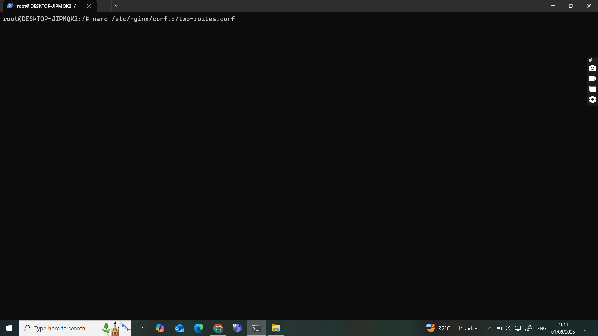

#configuration file to make nginx listen in port 85 , caching , edit in page of unknown path
```bash
nano /etc/nginx/conf.d/two-routes.conf
```



#html code for image path
```bash
nano /var/www/images/image/index.html
```


#html code for hello path
```bash
nano /var/www/hellopage/hello/index.html
```


#html code for unknown path
```bash
nano /var/www/errors/custom_404.html
```


#browse image path

#browse hello path

#browse unknown path

